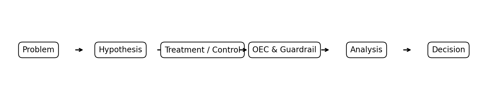

# A/B Testing and Causal Inference

### Improving registration on an online learning platform

[View the analysis](Final_Project_AB_Testing.ipynb) · [Explore the data](ab_test_data.csv) · [SDAIA Academy](https://github.com/SDAIAAcademy)

## Project Overview
This project evaluates whether a redesigned landing page for an online learning platform increases new-user registration conversion.

The analysis uses a **simulated A/B-test dataset** created for educational purposes.

## Problem & Hypothesis
The platform wants to improve the share of landing-page visitors who register.

- **H0:** Treatment and Control have the same registration conversion rate.
- **H1:** Treatment and Control have different registration conversion rates.
- **Control:** Current landing page.
- **Treatment:** Simplified landing page with a clearer CTA and shorter registration path.
- **Target users:** New visitors eligible to register.

## Experiment Design
- **Randomization:** 50/50 user-level assignment.
- **OEC / Primary metric:** Registration conversion rate.
- **Guardrail:** Page error rate.
- **Guardrail threshold:** No more than +0.50 percentage points worse than Control.
- **MDE / practical threshold:** +1.50 percentage points absolute registration lift.

## Results

| Metric | Control | Treatment | Result |
|---|---:|---:|---:|
| Users | 10,000 | 10,000 | — |
| Registration conversion | 12.00% | 14.50% | **+2.50 pp** |
| Relative lift | — | — | **+20.83%** |
| 95% CI of absolute lift | — | — | **[1.56, 3.44] pp** |
| p-value | — | — | **0.00000018** |
| Page error rate | 1.00% | 1.10% | **+0.10 pp** |

The primary metric is statistically significant at α = 0.05 and exceeds the predefined practical threshold.

## Decision
**Launch the Treatment within this educational scenario.**

The estimated lift is +2.50 percentage points, the 95% CI excludes zero and is above the practical threshold, and the guardrail remains within the allowed limit.

## Causal Reasoning
Random user assignment makes Treatment and Control comparable in expectation, reducing systematic differences between groups. Under standard experimental assumptions, the observed difference can therefore be interpreted as an estimate of the causal effect of the redesigned page.

## Workflow


**Problem → Hypothesis → Treatment/Control → OEC & Guardrail → Analysis → Decision**

## Run the Analysis

Download or clone this repository, open a terminal in its root folder, and run:

```bash
python -m pip install -r requirements.txt
python -m jupyter notebook Final_Project_AB_Testing.ipynb
```

Run all notebook cells in order. Keep the CSV and workflow image beside the notebook so relative paths resolve correctly. Saved outputs are also available for review without running Python.

## Dataset

The CSV contains 20,000 unique users, split equally between the two groups.

| Column | Meaning |
|---|---|
| `user_id` | Unique user identifier |
| `group` | Control or Treatment |
| `registered` | 1 if the user registered; otherwise 0 |
| `page_error` | 1 if the user experienced a page error; otherwise 0 |

## Repository Files
- `Final_Project_AB_Testing.ipynb` — complete analysis and written report.
- `ab_test_data.csv` — simulated experiment dataset.
- `workflow_diagram.png` — experiment workflow diagram.
- `README.md` — project summary.
- `requirements.txt` — Python dependencies.

## Tools Used
- Python
- pandas
- NumPy
- SciPy
- Jupyter Notebook
- GitHub

## SDAIA Academy GitHub Repository
https://github.com/SDAIAAcademy

## Important Note
The dataset is simulated for educational use; results should not be interpreted as real production performance.

The existing ZIP is the original uploaded package; use the individual files in this repository for the current project documentation.
